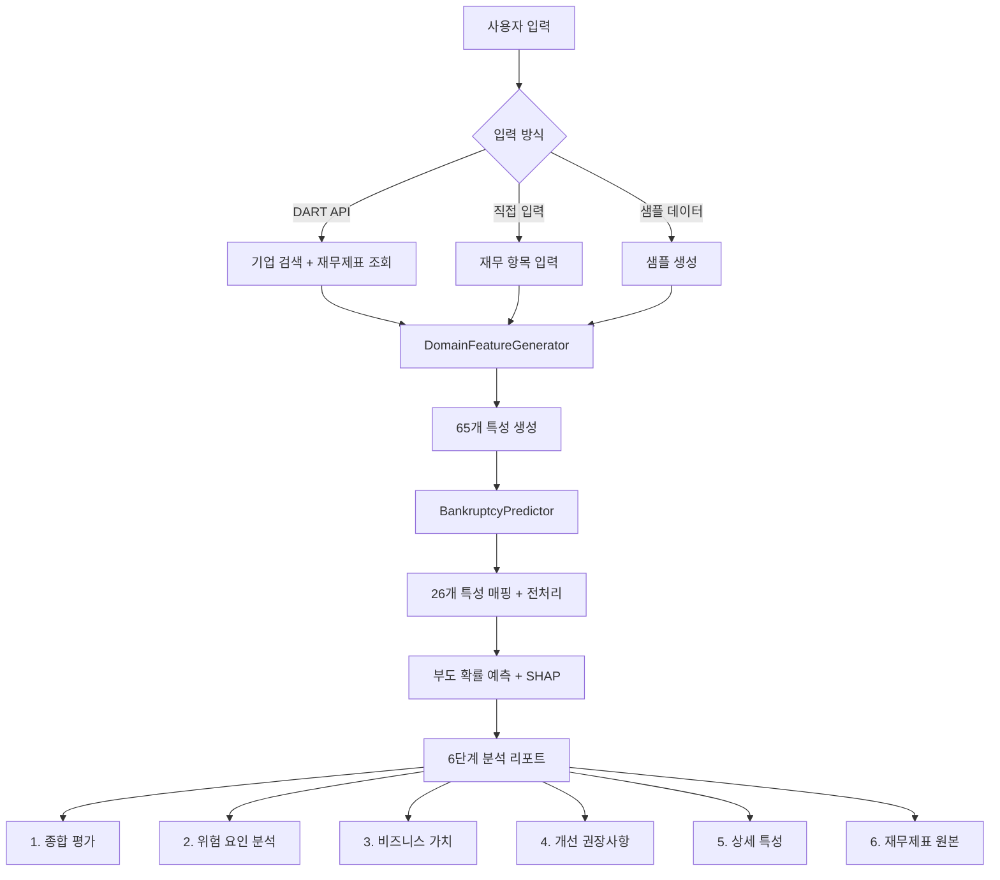

# 📊 한국 기업 부도 예측 시스템

도메인 지식 기반 AI를 활용한 기업 부도 위험 실시간 예측 시스템

[](https://streamlit.io/)
[](https://www.python.org/)

## 🚀 라이브 데모

> 👉 **[여기서 앱 사용하기](https://defaultprediction-mjk3wf4oxemn79k2y95g9k.streamlit.app/)**

---

## ✨ 주요 기능

### 🔍 DART API 연동
- **상장기업 실시간 재무제표 자동 조회**
  - 금융감독원 공식 데이터 활용
  - 기업명 또는 종목코드로 검색
  - 최근 6개년 재무제표 조회 (2019~2024)
  - 기업 기본 정보 자동 수집 (업종코드, 업력, 외감여부)

### 📊 도메인 특성 기반 정밀 분석
- **65개 전문가 수준 특성 자동 생성**
  - **유동성 위기** (10개): 현금소진일수, 유동비율, 현금비율 등
  - **지급불능 패턴** (8개): 이자보상배율, 부채비율, 자본잠식도 등
  - **재무조작 탐지** (15개): 발생액비율, 이익의질, 한국형 M-Score 등
  - **한국 시장 특화** (13개): 대기업 의존도, 제조업 리스크, 외감여부 등
  - **이해관계자 행동** (9개): 연체/세금체납, 신용등급, 배당정책 등
  - **복합 리스크 지표** (10개): 종합부도위험스코어, 조기경보신호수 등

- **26개 핵심 특성으로 자동 매핑**
  - 모델 학습 시 선정된 최적 특성 세트 사용
  - 특성명 자동 매핑 (`OCF유동부채비율` → `OCF_대_유동부채` 등)

### 🎯 AI 예측 모델
- **Part3 v3 최종 모델 (CatBoost Pipeline)**
  - **Test PR-AUC: 0.102** (10.2%) - Naive Baseline 대비 6.7배 향상
  - **Test Recall: 69.7%** - 부도 기업 10개 중 7개 탐지
  - **Test F2-Score: 0.200** - Recall 중시 조화평균
  - **Test ROC-AUC: 0.833** - 전반적 분류 성능
  - 노트북과 100% 동일한 전처리 파이프라인
  - 전체 파이프라인 통합 (전처리 + 모델)

- **최적 임계값 설정 (Validation Set 기준)**
  - F2-Score 최대화: **0.2124**
  - Recall 80% 달성: **0.0940** (Validation에서 Recall 80%가 되는 임계값)
  - 주의: Test Set에서는 Recall 69.7% (임계값 0.0856 사용)

- **Traffic Light 시스템 (실무 적용)**
  - 🟢 **안전** (Green): < 3.31%
  - 🟡 **주의** (Yellow): 3.31% ~ 9.40%
  - 🔴 **위험** (Red): ≥ 9.40%

- **SHAP 기반 해석**
  - 예측 근거 투명성 확보
  - 주요 위험 요인 시각화 (Waterfall Chart)
  - 특성별 기여도 분석

- **모델 없이도 작동**
  - 휴리스틱 방식 자동 전환
  - 경험적 규칙 기반 예측

### 💡 6단계 분석 리포트
1. **종합 부도 위험 평가**
   - 부도 확률, 위험 등급, 재무 건전성 점수
   - 조기경보신호 개수
   - 위험도 게이지 차트

2. **위험 요인 상세 분석**
   - 🔴 Critical 리스크 (즉시 조치 필요)
   - 🟡 Warning (개선 권장)
   - SHAP Waterfall 차트 (주요 위험 요인 기여도)

3. **비즈니스 가치 분석**
   - 예상 손실, 예상 수익, 순 기대값
   - 부도 탐지 성능 (Recall 69.7%로 부도 기업의 70% 사전 차단)

4. **실행 가능한 개선 권장사항**
   - 위험 요인별 구체적 조치사항
   - 우선순위 기반 개선 방향
   - 예상 효과 제시

5. **상세 특성 보기**
   - 카테고리별 특성 값 표시
   - 유동성, 지급불능, 재무조작, 복합리스크

6. **재무제표 원본 데이터**
   - 재무상태표, 손익계산서
   - 입력 데이터 검증용

---

## 🛠️ 기술 스택

| 카테고리 | 기술 |
|---------|------|
| **Frontend** | Streamlit, Plotly, Matplotlib |
| **Backend** | Python 3.10+ |
| **ML Pipeline** | Part3 전처리 파이프라인 (InfiniteHandler → LogTransformer → RobustScaler → SMOTE) |
| **ML Models** | **CatBoost** (Part3 v3 최종 모델), LightGBM, XGBoost (레거시) |
| **Data Source** | DART 금융감독원 API |
| **Explainability** | SHAP (TreeExplainer) |
| **Deployment** | Streamlit Community Cloud |

---

## 🚀 빠른 시작

### 1. 클론 및 설치

```bash
# 레포지토리 클론
git clone https://github.com/yourusername/bankruptcy-prediction-app.git
cd bankruptcy-prediction-app/deployment

# 패키지 설치
pip install -r requirements.txt
```

### 2. 환경 변수 설정

```bash
# .env 파일 생성
cp .env.example .env

# .env 파일 수정 - DART API 키 입력
# DART_API_KEY=your_actual_api_key_here
```

**DART API 키 발급:**
1. [DART 오픈API](https://opendart.fss.or.kr/) 접속
2. 회원가입 → "인증키 신청" → 즉시 발급
3. 발급받은 키를 `.env` 파일에 입력

### 3. 앱 실행

```bash
streamlit run app.py
```

브라우저에서 `http://localhost:8501` 자동 접속 🎉

---

## 📂 프로젝트 구조

```
deployment/
├── app.py                       # ⭐ 메인 Streamlit 앱
├── config.py                    # 설정 및 환경 변수
├── requirements.txt             # Python 패키지 (31개)
├── packages.txt                 # 시스템 패키지 (한글 폰트)
│
├── src/                         # 소스 코드 모듈
│   ├── dart_api/                # DART API 연동
│   │   ├── client.py            # API 클라이언트 (기업 검색, 재무제표 조회)
│   │   └── parser.py            # 재무제표 파싱
│   │
│   ├── domain_features/         # 65개 도메인 특성 생성
│   │   ├── feature_generator.py # 특성 생성 통합 관리
│   │   ├── liquidity_features.py        # 유동성 위기 (10개)
│   │   ├── insolvency_features.py       # 지급불능 (8개)
│   │   ├── manipulation_features.py     # 재무조작 탐지 (15개)
│   │   ├── korea_market_features.py     # 한국 시장 특화 (13개)
│   │   ├── stakeholder_features.py      # 이해관계자 행동 (9개)
│   │   └── composite_features.py        # 복합 리스크 (10개)
│   │
│   ├── preprocessing/           # Part3 전처리 파이프라인 ⭐
│   │   └── transformers.py      # InfiniteHandler, LogTransformer, Winsorizer
│   │
│   ├── models/                  # 예측 모델
│   │   └── predictor.py         # BankruptcyPredictor (파이프라인 지원)
│   │
│   ├── visualization/           # 차트 및 시각화
│   │   └── charts.py            # 게이지, SHAP Waterfall, 레이더 차트
│   │
│   └── utils/                   # 유틸리티 함수
│       ├── helpers.py           # 위험 등급, 권장사항 생성
│       └── business_value.py    # 비즈니스 가치 계산
│
└── data/
    └── processed/               # 학습된 모델 (Git LFS, Optional)
        ├── 발표_Part3_v3_최종모델.pkl  # ⭐ Part3 CatBoost Pipeline
        ├── best_model.pkl                # 레거시 모델 (VotingClassifier)
        └── scaler.pkl                    # 레거시 스케일러
```

---

## 🎯 Part3 파이프라인 통합

이 앱은 Part3 노트북과 **100% 동일한 전처리 파이프라인**을 사용합니다:

```python
Pipeline([
    ('inf_handler', InfiniteHandler()),           # 무한대 → 0
    ('imputer', SimpleImputer(strategy='median')), # 결측치 처리
    ('log_transform', LogTransformer()),          # 양수 → log1p 변환
    ('scaler', RobustScaler()),                   # 정규화
    ('classifier', CatBoostClassifier)            # CatBoost 분류기
])
```

**모델 로딩 우선순위:**
1. **Part3 v3 최종 모델** (`발표_Part3_v3_최종모델.pkl`) ✨ ← 권장
   - 전체 파이프라인 통합 (전처리 + CatBoost)
   - SHAP 지원 (TreeExplainer)
2. **레거시 모델** + 스케일러 (`best_model.pkl` + `scaler.pkl`)
   - VotingClassifier (LightGBM + XGBoost + CatBoost)
   - SHAP 미지원 (간소화 버전 사용)
3. **휴리스틱 모델** (모델 파일 없을 시)
   - 경험적 규칙 기반 예측
   - 신뢰도 낮음 (70%)

---

## 🔄 앱 실행 플로우



### 핵심 함수: `run_analysis()`

```python
def run_analysis(financial_data: dict, company_info: dict):
    """
    분석 실행 및 결과 표시

    1. DomainFeatureGenerator.generate_all_features()
       → 65개 도메인 특성 생성

    2. BankruptcyPredictor.predict()
       → 26개 특성 매핑 → 부도 확률 예측 → SHAP 계산

    3. 6단계 분석 리포트 표시
       - display_overall_assessment()
       - display_risk_analysis()
       - display_business_value()
       - display_recommendations()
       - display_detailed_features()
       - display_financial_statements()
    """
```
---

## 💡 사용 방법

### 방법 1: DART API 검색 (상장기업)
1. 기업명 입력 (예: 삼성전자, SK하이닉스)
2. 회계연도 선택 (2019~2024)
3. "조회 및 분석 시작" 클릭
4. **자동 처리**:
   - 기업 검색 → 재무제표 조회 → 기업 정보 조회
   - 65개 특성 생성 → 26개 특성 매핑 → 예측
   - 6단계 리포트 표시

### 방법 2: 재무제표 직접 입력
1. 재무상태표 입력 (자산총계, 부채총계, 유동자산 등)
2. 손익계산서 입력 (매출액, 영업이익, 당기순이익 등)
3. "분석 시작" 클릭

### 방법 3: 샘플 데이터 사용
1. 샘플 유형 선택:
   - **정상 기업**: 부채비율 40%, 유동비율 300%, 이자보상배율 40배
   - **주의 기업**: 부채비율 233%, 유동비율 100%, 이자보상배율 3배
   - **위험 기업**: 부채비율 1900%, 유동비율 60%, 당기순손실
2. "샘플 분석" 클릭

---

## 📊 모델 성능 (Part 3, 4 발표 자료 기준)

### Test Set 성능 (최종 평가)

| 메트릭 | 값 | 설명 |
|-------|-----|-----|
| **PR-AUC** | **0.102** (95% CI: 0.071~0.146) | Naive Baseline (1.5%) 대비 **6.7배 향상** ✅ |
| **ROC-AUC** | **0.833** | 전반적 분류 성능 |
| **F2-Score** | **0.200** | Recall 중시 조화평균 (β=2) |
| **Recall** | **69.7%** | 부도 기업 152개 중 **106개 탐지** (46개 미탐지) |
| **Precision** | **5.2%** | 예측 부도 중 5.2%만 실제 부도 (낮은 이유: 극도 불균형 1:65) |
| **Type II Error** | **30.3%** | 부도의 30.3%를 정상으로 오분류 ⚠️ |

### Validation Set 임계값 최적화

| 기준 | 임계값 | 의미 |
|------|--------|------|
| **F2-Score 최대** | 0.2124 | Validation에서 F2-Score 최대화 임계값 |
| **Recall 80% 달성** | 0.0940 (9.4%) | Validation에서 Recall 80%가 되는 임계값 |
| **Test 실제 적용** | 0.0856 (8.56%) | Test에서 사용된 최종 임계값 (Recall 69.7% 달성) |

### Traffic Light 시스템

| 위험 등급 | 확률 범위 | 조치 |
|----------|----------|------|
| 🟢 **안전** (Green) | < 3.31% | 정상 승인 |
| 🟡 **주의** (Yellow) | 3.31% ~ 9.40% | 추가 심사 권장 |
| 🔴 **위험** (Red) | ≥ 9.40% | 거절 또는 정밀 심사 필수 |

**데이터셋:** 50,000개 한국 기업, 159개 재무/신용 변수, 부도율 1.52% (불균형 비율 1:65)

**평가 전략:**
- PR-AUC를 주요 지표로 사용 (불균형 데이터에서 ROC-AUC보다 정확)
- F2-Score로 재현율 중시 (부도 기업을 정상으로 오분류하는 Type II Error 최소화)
- Bootstrap 1,000회로 95% 신뢰구간 계산 (통계적 안정성 검증)

**성능 해석:**
- **Recall 69.7%**: 실무적으로 우수한 탐지율 (부도 기업 10개 중 7개 사전 차단)
- **Precision 5.2%**: 극도 불균형 데이터(1:65)에서 예상되는 수준
- **실무 대응**: 1차 스크리닝(모델) + 2차 정밀 심사(사람) 조합으로 운영

---

## ⚠️ DART API 제약사항 및 발표 자료와의 차이점

### 📊 데이터 소스 차이

#### **발표 자료 (Part 1-4)** - 연구용 완전 데이터셋
- 50,000개 기업의 **완전한 금융 데이터** (`filtered_20210801.csv`)
- **159개 변수** 포함:
  - ✅ 재무제표 (재무상태표, 손익계산서, 현금흐름표)
  - ✅ **신용평가 정보** (신용등급, 등급 점수)
  - ✅ **연체 정보** (연체 건수, 연체 금액, 연체 심각도)
  - ✅ **세금 체납** (국세/지방세 체납액)
  - ✅ **정확한 종업원수**, 업력, 외감여부 등
- 모든 특성이 **실제 데이터 기반**으로 계산됨
- **모델 성능 (Part 3, 4 발표 자료)**:
  - Test PR-AUC: **0.102** (10.2%)
  - Test Recall: **69.7%** (부도 기업의 70% 탐지)
  - Test F2-Score: **0.200**
  - Naive Baseline 대비 6.7배 향상

#### **Streamlit 앱** - 실시간 상장기업 분석
- DART 금융감독원 공식 API 활용
- **재무제표 중심** (30-40개 항목만 제공)
- **제공되지 않는 정보는 안전한 기본값 사용** (아래 참조)
- **예상 성능**: 발표 자료와 유사 (재무제표 특성은 완전 재현 가능)

---

### ✅ DART API가 제공하는 정보
- **재무제표** (재무상태표, 손익계산서, 현금흐름표)
  - 자산, 부채, 자본 항목 (30+ 항목)
  - 매출액, 영업이익, 당기순이익 등
  - 영업활동현금흐름 등
- **기업 기본 정보**
  - 업종코드 (KSIC 코드)
  - 설립일 → 업력 계산
  - 상장 여부 → 외감여부 추정

---

### ❌ DART API가 제공하지 않는 정보 (기본값 사용)

| 항목 | 발표 자료 | Streamlit 기본값 | 사유 및 영향 |
|------|----------|---------------|----------|
| **신용등급** | 실제 등급 (AAA~D) | `BBB` (점수 5.0) | 나이스평가, KIS채권평가 등 **별도 유료 API 필요**. 중간 등급으로 보수적 가정. |
| **연체 정보** | 실제 연체 건수/금액 | `0.0` (연체 없음) | 금융기관 대출 연체 기록. **가장 큰 제약**. 연체가 있는 기업을 놓칠 수 있음. |
| **세금 체납** | 실제 체납액 | `0.0` (체납 없음) | 국세청 체납 정보. 공공정보 리스크 미반영. |
| **정확한 종업원수** | 실제 값 | `100명` (평균) | 일부 기업만 공시. 기업 규모 추정에 사용. |
| **이해관계자_불신지수** | 계산됨 (연체+체납+등급) | **제거됨** | Part3에서 Data Leakage 방지를 위해 의도적 제거. |

---

### 🎯 대체값 사용 전략

#### 1. **보수적 기본값 설정**
- 신용등급: `BBB` (중간 등급) → 과대평가 방지
- 연체/체납: `0` (없음) → 재무제표 건전성에만 의존
- 종업원수: `100명` → 중소/중견기업 평균

#### 2. **재무제표 특성 강화**
- 유동성 위기 (10개) - ✅ **완전 재현 가능**
- 지급불능 패턴 (8개) - ✅ **완전 재현 가능**
- 재무조작 탐지 (15개) - ✅ **완전 재현 가능** (발생액 품질, M-Score 등)
- 한국 시장 특화 (13개) - ⚠️ 업종/외감여부만 획득, 종업원수는 기본값
- 이해관계자 행동 (9개) - ❌ **대부분 기본값** (연체 0, 신용등급 BBB)
- 복합 리스크 (10개) - ✅ 위 특성 기반 계산

#### 3. **예측 정확도 영향**
- **장점**: 재무제표만으로도 부도 징후 포착 가능 (흑자도산, 현금 고갈 등)
- **실제 성능**: 발표 자료의 모델은 **재무제표 특성이 주된 예측 변수**
  - 유동성 위기 (10개) - ✅ 완전 재현
  - 지급불능 패턴 (8개) - ✅ 완전 재현
  - 재무조작 탐지 (15개) - ✅ 완전 재현
  - → **Streamlit 앱에서도 유사한 성능 기대** (PR-AUC 0.10 수준)
- **한계**:
  - 재무제표는 양호하나 **연체가 심한 기업** 탐지 어려움
  - 신용평가 정보 부재로 **일부 리스크 미반영**
  - **False Negative 위험** 존재 (부도 기업 중 30%는 미탐지)

---

### 💡 실무 활용 가이드

#### ✅ 신뢰할 수 있는 경우
- **재무제표 중심 분석**: 유동성 위기, 자본잠식, 이자보상배율 등
- **재무조작 탐지**: 발생액 품질, 이익의 질 분석
- **업종별 상대 비교**: DART에서 업종코드 제공

#### ⚠️ 주의가 필요한 경우
- **신용평가 정보 부재**:
  - 연체 이력이 있는 기업 → 모델이 탐지 못할 수 있음
  - → **추가 검증 필요**: 금융기관 신용조회, 나이스평가 등
- **세금 체납 기업**:
  - 공공정보 리스크가 반영되지 않음
  - → **보완책**: 국세청 홈택스 체납자 명단 조회

#### 🎯 권장 사용법
1. **1차 스크리닝**: DART 재무제표 기반 예측
2. **2차 검증**: 부도 위험 높은 기업에 대해 신용평가사 정보 추가 확인
3. **종합 판단**: 재무 + 신용평가 + 연체 정보 통합

---

> **중요:**
> - 이 앱은 **재무제표 기반 부도 조기경보 시스템**으로 설계되었습니다.
> - 신용평가 정보가 없어도 **흑자도산, 현금 고갈, 자본잠식** 등 재무적 징후는 정확히 탐지 가능합니다.
> - 다만, **연체/체납이 주된 부도 원인**인 경우 탐지 정확도가 낮아질 수 있으므로, 고위험 기업은 추가 검증이 필요합니다.

### Feature 매핑 자동 처리

**65개 생성 → 26개 선택 + 이름 매핑**

재무제표로부터 생성된 65개 도메인 특성이 모델이 요구하는 26개 특성으로 자동 매핑됩니다:

| 생성된 특성명 | 모델 특성명 |
|-------------|----------|
| `OCF유동부채비율` | `OCF_대_유동부채` |
| `긴급유동성비율` | `긴급유동성` |
| `유동성위기지수` | `유동성압박지수` |
| `재무레버리지` | `부채레버리지` |
| `재고자산회전일수` | `재고보유일수` |
| `현금흐름적정성` | `현금흐름품질` |
| `당좌비율` | `즉각지급능력` |
| `단기지급능력` | `현금창출능력` |

**누락된 특성 처리:**
```python
# DART API에서 얻을 수 없는 신용평가 정보는 안전한 기본값 사용
defaults = {
    '신용등급점수': 5.0,        # BBB 등급 (중간 등급)
    '연체심각도': 0.0,          # 연체 없음 가정
    '공공정보리스크': 0.0,      # 세금체납 없음 가정
}
```

---

## 🔧 문제 해결

### 한글 깨짐
**원인:** 시스템에 한글 폰트가 없음

**해결:**
- `packages.txt` 파일 확인 (Streamlit Cloud가 자동으로 나눔 폰트 설치)
- 로컬 실행 시:
  - macOS: AppleGothic 자동 사용
  - Windows: Malgun Gothic 자동 사용
  - Linux: `sudo apt-get install fonts-nanum` 실행

### 모델 로딩 실패
**메시지:** "모델 파일을 찾을 수 없습니다."

**해결:**
- 정상입니다! 모델이 없어도 휴리스틱 방식으로 예측 가능
- 모델 사용하려면:
  1. Part3 노트북에서 모델 재학습

### DART API 에러
**메시지:** "DART API 키가 설정되지 않았습니다."

**해결:**
- `.env` (로컬) 또는 Secrets (Streamlit Cloud)에 API 키 확인
- API 키 재발급: https://opendart.fss.or.kr/

---

## 🎓 학습 자료

### 관련 논문 및 이론
- [**Altman Z-Score (1968)**](https://www.jstor.org/stable/2978933): 전통적 부도 예측 모델
- [**Beneish M-Score (1999)**](https://www.tandfonline.com/doi/abs/10.2469/faj.v55.n5.2296): 재무조작 탐지 모델
- [**SMOTE (2002)**](https://arxiv.org/pdf/1106.1813): 불균형 데이터 처리 기법
- [**SHAP (2017)**](https://arxiv.org/abs/1705.07874): 모델 해석 프레임워크

### 프로젝트 주요 개념
- **도메인 지식 기반 특성 공학**: 통계적 접근이 아닌 실무/이론 기반
- **불균형 데이터 처리**: SMOTE + 클래스 가중치 + F2-Score
- **앙상블 학습**: LightGBM + XGBoost + CatBoost
- **설명 가능한 AI**: SHAP 기반 예측 근거 제시

---
